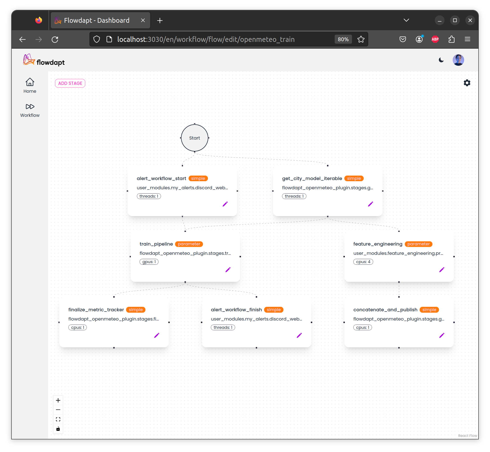
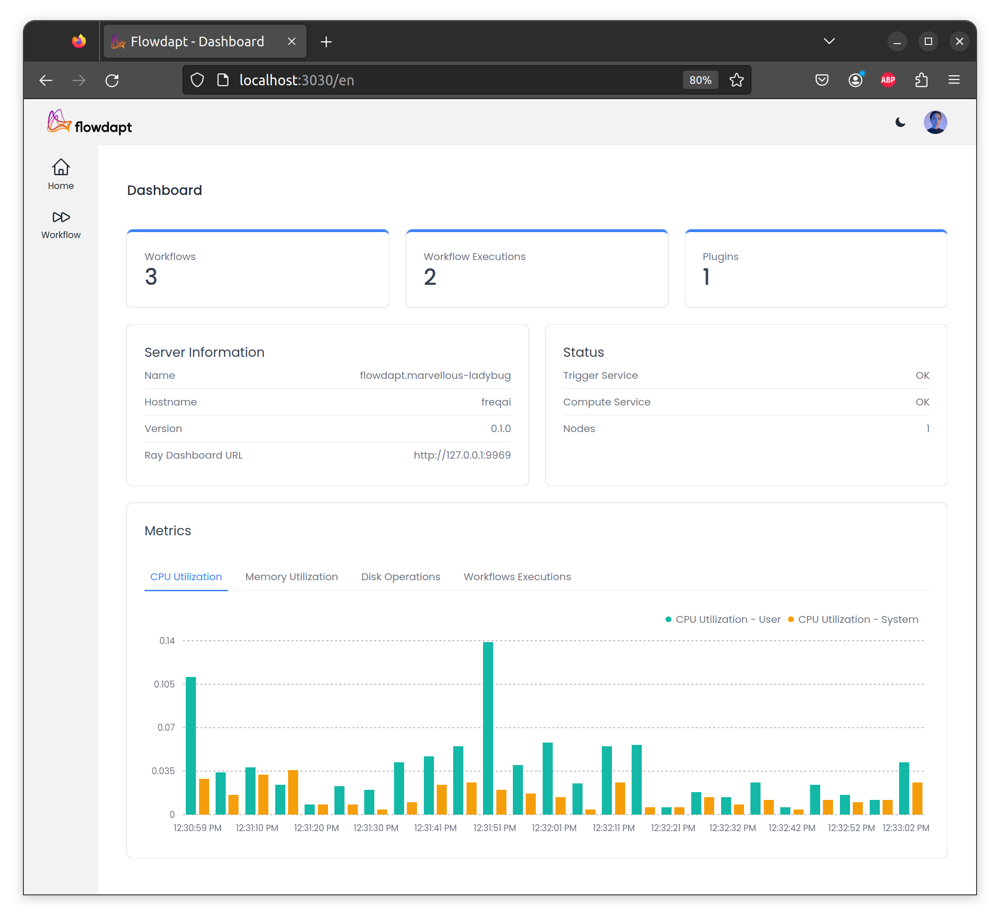

# Dashboards

## Flowdapt workflow dashboard

The flowdapt workflow dashboard allows you to build and deploy complex workflows using a graphical interface as shown here:

and monitor key health metrics of your deployment:

### Installation

The Flowdapt workflow dashboard can be installed using the following instructions:

#### Step 1: Node.js Verification and Installation

Check if Node.js is installed on your machine by opening a terminal (Command Prompt in Windows or Terminal in MacOS/Linux) and running the command `node -v`. This will display the version of Node.js installed. If successful, you should see output like `v18.15.0`.

If Node.js is not installed, download it from the [official Node.js website](https://nodejs.org/en/download/) and follow the prompts to install it.

#### Step 2: Clone the Repository

Clone the project repository from the provided link (contact us at [Emergent Methods](mailto:contact@emergentmethods.ai) for early acccess).

#### Step 3: Install Required Packages

Navigate to the root directory of the repository in the terminal and run `npm i` to install all the required packages.

#### Step 4: Verify API Address

By default, the `.env` file contains the default API address. If you need to modify the API address, create a `.env.local` file and define the environment-specific variables there.

#### Step 5: Start Flowdapt

Start Flowdapt to make the API endpoint available.

#### Step 6: Start the Dashboard

You have two options for starting the dashboard:

1. **Developer Mode:** Run `npm run dev` to start the server in developer mode. Changes made to the code will automatically reflect in your browser.

2. **Production Mode:** Run `npm run build` followed by `npm run start`. The `build` command creates the build for the project, and the `start` command serves the dashboard on a http port.

## Executor dashboards

Deeper cluster specific metrics and task graphs can be visualized using the executor dashboards. These dashboards are automatically exposed when the Flowdapt server is launched. The two executors currently available, [Ray dashbord](https://docs.ray.io/en/latest/ray-core/ray-dashboard.html) or the [Dask dashboard](https://docs.dask.org/en/stable/dashboard.html) will be automatically available on a local server (typically at `127.0.0.1:9969`). These dashboards are most useful for identifying weak parallelization points in a workflow and for tracking bugs back to origin tasks/functions. Additionally, this dashboard provides active resource usage and computational graphs. We encourage users to visit the respective documentations for more details about various functionalities.