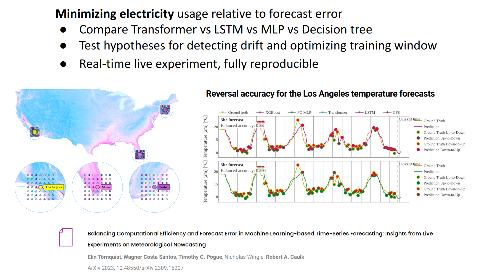

# Weather Nowcasting with Flowdapt

## Introduction

Emergent Methods performed a large-scale nowcasting experiment in real-time to study the relationship between forecast accuracy and computational efficiency. The full report with all results are detailed in the [companion paper](https://arxiv.org/abs/2309.15207). The experimental code is simplified in the [Nowcast repository](https://gitlab.com/emergentmethods/flowdapt-nowcast-plugin) as an example for how flowdapt can be used to build a real-time adaptive modeling system. Here we provide an overview of how the components are constructed.



## Train workflow

The train workflow gets the city iterable to parameterize the train_pipeline across the desired number of cities. The train workflow does not worry about getting data, it pulls the latest data available, which is already prepped by the data update workflow.

```yaml
kind: workflow
metadata:
  name: train
  annotations:
    group: nowcast
spec:
  stages:
    - name: get_city_model_iterable
      target: flowdapt_nowcast_plugin.stages.get_city_model_iterable
      resources:
        cpus: 0.5

    - name: train_pipeline
      target: flowdapt_nowcast_plugin.stages.train_pipeline
      type: parameterized
      depends_on:
        - get_city_model_iterable
      resources:
        gpus: 1
```

## Inference workflow

The inference workflow gets the city iterable to parameterize the predict_pipeline across the desired number of cities. The inference workflow does not worry about getting data, it pulls the latest data available, which is already prepped by the data update workflow.

```yaml
kind: workflow
metadata:
  name: predict
  annotations:
    group: nowcast
spec:
  stages:
    - name: get_city_model_iterable
      target: flowdapt_nowcast_plugin.stages.get_city_model_iterable
      resources:
        cpus: 0.5

    - name: predict_pipeline
      target: flowdapt_nowcast_plugin.stages.predict_pipeline
      type: parameterized
      depends_on:
        - get_city_model_iterable
      resources:
        cpus: 4
```

## Data update workflow

The data update workflow fetches data for the target cities, as well as auxiliary cities that may be used to help improve accuracy on the target cities. It stores the data and prepares the features so that the train and inference workflows are focused entirely on training or inferencing at low-latency.

```yaml
kind: workflow
metadata:
  name: create_features
  annotations:
    group: nowcast
spec:
  stages:
    - name: create_parameterization_lists
      target: flowdapt_nowcast_plugin.stages.create_parameterization_lists
      resources:
        cpus: 0.5

    - name: get_unique_city_iterable
      target: flowdapt_nowcast_plugin.stages.get_unique_city_iterable
      depends_on:
        - create_parameterization_lists
      resources:
        cpus: 0.5

    - name: get_and_publish_data
      target: flowdapt_nowcast_plugin.stages.get_and_publish_data
      type: parameterized
      depends_on:
        - get_unique_city_iterable
      resources:
        cpus: 1

    - name: get_target_city_iterable
      target: flowdapt_nowcast_plugin.stages.get_target_city_iterable
      depends_on:
        - get_and_publish_data
      resources:
        cpus: 0.5

    - name: construct_dataframes
      target: flowdapt_nowcast_plugin.stages.construct_dataframes
      type: parameterized
      depends_on:
        - get_target_city_iterable
      resources:
        cpus: 1
```

## Configuration

```yaml
kind: config
metadata:
  name: main
  annotations:
    group: nowcast
spec:
  selector:
    type: annotation
    value:
      group: nowcast
  data:
    study_identifier: "openmeteo_test"
    # Study control parameters
    n_days: 50
    neighbors: 2
    radius: 150
    prediction_points: 1
    target_horizon: 6
    city_data_path: "flowdapt_nowcast_plugin/data/uscities.csv"
    model: "XGBoostRegressor"
    cities: ['Los Angeles', 'Miami']
    targets: ["temperature_2m", "windspeed_10m", "cloudcover"]
    # training parameters
    model_train_parameters:
      # xgboost parameters
      n_jobs: 4
      n_estimators: 200
      # device: "cuda"
      # tree_method: "hist"
      alpha: 0.5
      min_child_weight: 5
      learning_rate: 0.1
      eval_metric: "rmse"
      max_depth: 6
      verbosity: 1
      lookback: 6
      # # neural net parameters for PyTorch variants
      # epochs: 10  # 35
      # batch_size: 64
      # lookback: 6
      # hidden_dim: 2048
      # shuffle: True
      # num_threads: 4
    extras:
      weight_factor: 0.9
      di_threshold: 5.0
      num_points: 1200  # 3500
      artifact_only: true
      data_split_parameters:
        test_size: 256
        shuffle: false
```

## Running Nowcast

After you installed `flowdapt` with `pip install flowdapt` and `flowctl` with `pip install flowctl`, you can clone the [Nowcast Plugin](https://gitlab.com/emergentmethods/flowdapt-nowcast-plugin) repository and install:

```bash
git clone https://gitlab.com/emergentmethods/flowdapt-nowcast-plugin.git
cd flowdapt-nowcast-plugin
poetry install
```

Now you can apply your resources:

```bash
flowctl apply -p flowdapt_nowcast_plugin/workflows
flowctl apply -p flowdapt_nowcast_plugin/configs
```

You can run the workflows manually if you wish with `flowctl run create_features` and `flowctl run train_pipeline` and `flowctl run predict_pipeline`. However, these are typically scheduled with the included triggers:

```bash
flowctl apply -p flowdapt_nowcast_plugin/triggers
```

Further, you can use the `flowdapt_sdk` to automate these processes, or to ask for the latest predictions. This functionality is exemplified in the `python_driver.py` file.


Details about the `train_pipeline`, `predict_pipeline`, and `create_features` stages can be found in the [Nowcast Plugin](https://gitlab.com/emergentmethods/flowdapt-nowcast-plugin) repository.