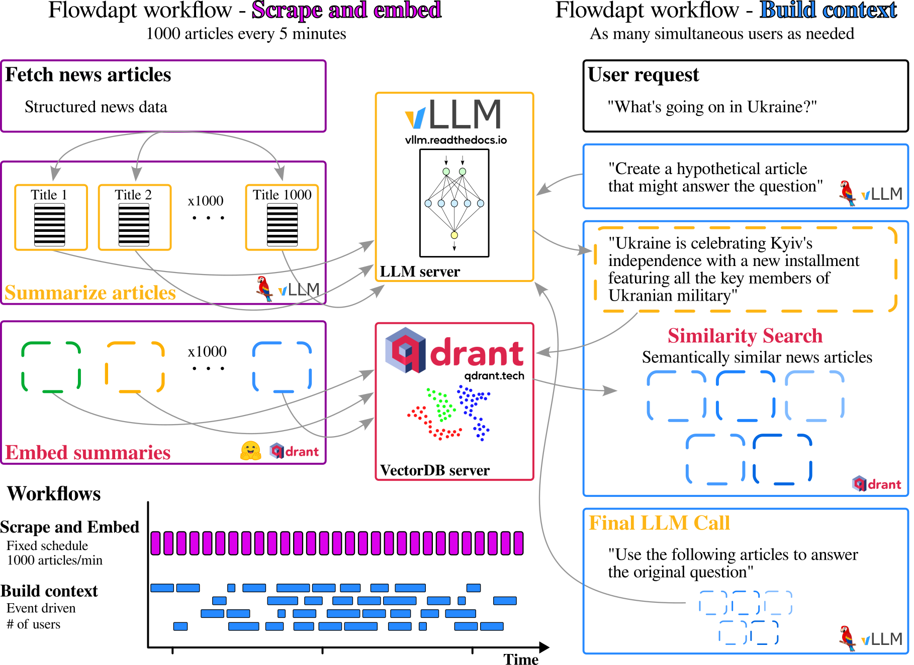

# Large-scale news distillation for production
## Harmonizing Flowdapt, Qdrant, vLLM

Retreival Augmented Generative AI (RAG) is a new approach to infusing large language models with information that was not present during training. Most RAG examples are constrained to off-premise LLMs (like OpenAI or Claude), static knowledge bases (upload documents once) and are designed to interact with a single user. These limitations allow for fun toys, but they do not scale to production.

Instead, we at Emergent Methods formulated a production scale news distillation architecture that is based on three key softwares:
- Flowdapt: large-scale orchestration of cluster-compute (with the Ray executor)
- Qdrant: high-performance rust-based vector database
- vLLM: high-throughput LLM server employing paged-attention and continuous batching mechanisms

As shown in Figure 1, the architecture is focused primarily on a highly parallelized interconnected set of services where [Flowdapt](https://flowdapt.ai) plays the role of orchestration, [vLLM](https://vllm.readthedocs.io) plays a role of a reasoning engine underpinning 30 unique back and front end calls to an on-premise LLM, and [Qdrant](https://qdrant.tech) plays the role of high-performance similarity search for building context engineering for the final LLM call. 


*Figure 1: The architecture of Paperboy, Flowdapt's large-scale news distillation system*


# Paperboy

The Paperboy plug-in to Flowdapt is written in vanilla python, despite being highly parallelized across a distributed Ray/Dask backend. Here we provide a general structure and overview of how the most important components are combined.

## Scrape and embed workflow
Paperboy is the Flowdapt plug-in that orchestrates the entire system shown in Figure 1. The scrape and embed workflow is defined by two functions. The first function is called `get_all_articles()` and it scrapes the news api for the latest news articles. It returns the scraped articles as a list. This list is then parameterized across the second function `summarize_and_embed(article)`. Flowdapt then parallelizes the second function across the list of articles, ensuring to respect resource limitations.


```py
import requests
from flowdapt.compute.object_store import put
from flowdapt.compute.resource.workflow.context import get_run_context
from flowdapt.lib.logger import get_logger

def get_all_articles(*args):
    """
    Get the current set of articles from a news API
    """
    # You can access your workflow context which contains
    # all the information about present workflow and configuration files
    confing = get_run_context().config

    # get the endpoint to your news api and make a first
    # request to get the number of articles
    url = 'https://your_news_api.com/v1'

    # build your params dynamically here, or use the config to set your keywords of interest
    params = {'q': config["queries"], 'from_': '6 hours ago'}
    headers = {'x-api-token': 'your-token'}

    response = requests.get(url, params=params, headers=headers).json()

    articles = remove_duplicate_articles(articles)
    articles = shuffle_articles(articles)

    # store the time of scrape in cluster memory so that we can
    # scrape from that date in the next scheduled scrape
    put(
        f"last_checked_time",
        datetime.now(timezone.utc),
        artifact_only=True
    )

    # return the articles as a list that will parameterize the next stage.
    logger.info(f"Final number of articles going for embedding is {len(articles)}")
    return articles
```

Meanwhile, the `summarize_and_embed()` function is defined in typical python fashion, where it takes a single article and summarizes and embeds it.


```py
from langchain.chat_models import ChatOpenAI
from flowdapt_paperboy_plugin import prompts
from flowdapt_paperboy_plugin import utils
from langchain.schema import Document

def summarize_article(article: dict):
    """
    This stage is parameterized by the preceding function called `get_all_articles`. The list of article dicts
    returned from `get_all_articles()` defines the parameterization of this function. This function
    is run once for each article in the list returned from `get_all_articles()`.
    """

    # using langchain to call a locally hosted vLLM
    llm = ChatOpenAI(
        openai_api_base=config["llm_base_url"],  # if you are running vLLM locally
        model="meta-llama/llama2-13b-chat-hf"
    )

    # summarize and get classification from llm
    text = f"""
Title: {article['title']}
Article: {article["content"]}
Published: {date}
Source: {article['source']['domain']}
"""
    try:
        agent = prompts.SUMMARIZE_ARTICLE_TEMPLATE | llm
        response = agent.invoke({"input": text})
        parsed_dict = utils.extract_summary_from_string(content)
    except Exception as e:
        logger.warning(f"Could not parse {article['title']}, {e}")
        pass

    # create a document for to embed to the vectorstore
    page_content = f"""
title: {article['title']}
summary: {parsed_dict["summary"]}
source: {article['source']['domain']}
"""
    document = Document(
        page_content=page_content,
        metadata={
            "article": article,
            "type": "summary",
            "timestamp": article["pubDate"],
            "articleId": article["articleId"]
        }
    )

    return document
```


Here we see that the following stage is also parameterized on the output of `summarize_article`. `update_vectorstore_documents()` is defined as:

!!! danger
    We use the langchain qdrant wrapper here for simplicity, but it is generally preferable to use the Qdrant client directly as it provides more flexibility.

```py
from qdrant_client import QdrantClient
from langchain.embeddings import HuggingFaceEmbeddings
from langchain.vectorstores import Qdrant

def update_vectorstore_documents(documents):
    """
    Given a list of documents, embed with huggingface and update the Qdrant
    vectorstore
    """
    config = get_run_context().config

    # we define the embedding function here
    embedding_function = HuggingFaceEmbeddings(
        model_name="thenlper/gte-small",
        model_kwargs={'device': 'cpu'} ,
        encode_kwargs={'normalize_embeddings': False}
    )

    client = QdrantClient(url=config["qdrant_url"]) # if you are hosting qdrant locally
    qdrant = Qdrant(client, config["study_identifier"], embeddings=embedding_function)

    try:
        # if the collection exists, add to it
        qdrant.add_documents(documents)
    except Exception as e:
        logger.info(f"Creating new qdrant collection because {e}")
        qdrant.from_documents(
            documents,
            embedding_function,
            url=config["qdrant_url"],
            collection_name="my_first_news_rag"
        )
    return
```

## Defining workflows and configs

In Flowdapt, the workflows and configs are defined using Kubernetes-style schemas. For example, the summarize and embed workflow is then defined as:

```yaml
kind: workflow
metadata:
  name: scrape_and_summarize
  annotations:
    group: paperboy
spec:
    stages:
        - name: get_all_articles
          target: flowdapt_paperboy_plugin.newsapi.get_all_articles
          resources:
          cpus: 0.5

        - name: summarize_article
          target: flowdapt_paperboy_plugin.newsapi.summarize_article
          # use type: parameterized to indicate that this stage will be parameterized
          # across the output of the depends_on stage
          type: parameterized
          depends_on:
              - get_all_articles
          resources:
              embedders: 1
              vllm: 1

        - name: upsert_vectorstore
          target: flowdapt_paperboy_plugin.utils.update_vectorstore_documents
          # use type: parameterized to indicate that this stage will be parameterized
          # across the output of the depends_on stage
          type: parameterized
          depends_on:
              - summarize_article
          resources:
              embedders: 1
```

Define your config with:

```yaml
kind: config
metadata:
  name: main
  annotations:
    group: paperboy
spec:
  selector:
    type: annotation
    value:
      group: paperboy
  data:
    study_identifier: test_run1
    queries:
        - stock market
        - investing
        - finance
    qdrant_url: http://localhost:6333
    llm_base_url: http://localhost:8000
    query_model: meta-llama/llama2-13b-chat-hf
```

And add a trigger to schedule the workflow every 6 hours:

```yaml
kind: trigger_rule
metadata:
  name: trigger_scrape
spec:
  type: schedule
  rule:
    - "0 */6 * * *"
  action:
    target: run_workflow
    parameters:
      workflow: scrape_and_summarize
```

## Starting the server

This workflow can now be started with:

```bash
# start the flowdapt server in a separate process
flowdapt run &

# sync the workflows to the server, the schedule is registered
# and the server will handle the rest
flowctl apply -p path/to/workflows
flowctl apply -p path/to/configs
```

Now, the workflow can be run manually with `flowctl run scrape_and_summarize`. But if you would like to activate the scheduled trigger that we wrote above, you would apply it:

```bash
flowctl apply -p path/to/trigger.yaml
```

## Build context workflow

The build context workflow is defined by a single function `build_context()` that is called each time a user calls the /chat endpoint on paperboy.


!!! danger
    While this following example is interesting, technically to scale this properly you would want to use an `async` stage and ensure your embedding is performed by an external server (we use Text Embedding Inference in production). In that case, you would use an asynchronous Qdrant client directly and await your calls to each service, 1. the embedding server, 2. the vector store, and 3. the vLLM server. This would allow the single python process to service many users asynchronously. However, here we stick to the same objects and functions as above for simplicity.

  This function is defined as:

```py
def build_context(prompt):
    """
    The stage called when a user makes their query. The payload from the user must include
    "prompt" which is the query,
    "uuid" which is the user's uuid(optional)
    "profile" which is the user's profile(optional)
    """

    context = get_run_context()
    config = context.config

    embedding_function = HuggingFaceEmbeddings(
        model_name="thenlper/gte-small",
        model_kwargs={'device': 'cpu'},
        encode_kwargs={'normalize_embeddings': False}
    )

    client = QdrantClient(config["qdrant_url"])
    vector_store = Qdrant(client, config["study_identifier"], embedding_function)

    llm = ChatOpenAI(
        openai_api_base=config["llm_base_url"],
        model=config["query_model"]
    )

    docs_scores += vector_store.similarity_search_with_score(prompt, k=5,  score_threshold=0.95)

    logger.warning(f"Found {len(docs_scores)} documents.")

    # build the context from the retrieved documents
    docs_context = ""
    doc_list = []

    for i, tup in enumerate(docs_scores):
        doc = tup[0]
        logger.debug(f"Here is the summary: {doc.page_content}")
        item = f"\n[{i+1}]:\n{doc.page_content}"
        docs_context += item
        doc_list.append(doc)


    return {"context": docs_context}
```

The build context workflow is then defined as:

```yaml
kind: workflow
metadata:
  name: build_context
  annotations:
    group: paperboy
spec:
    stages:
    - name: build_context
        target: flowdapt_paperboy_plugin.paperboy.build_context
        resources:
        vllm: 1
```

This workflow can be tested with:

```bash

```bash
# assuming the flowdapt server is still running in a separate process
# as shown above

flowctl run build_context --prompt What is the best way to invest in the stock market?
```

Which will return the context. You can feed that context into your favorite LLM to generate a response:

```py
# langchain ChatOpenAI object

response = agent.invoke({"input": context})
```