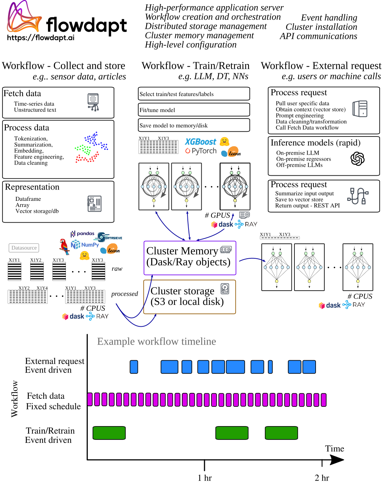
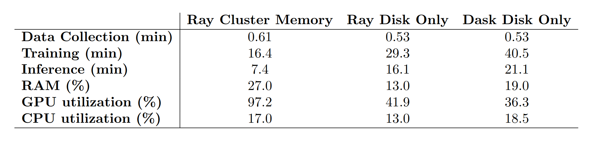
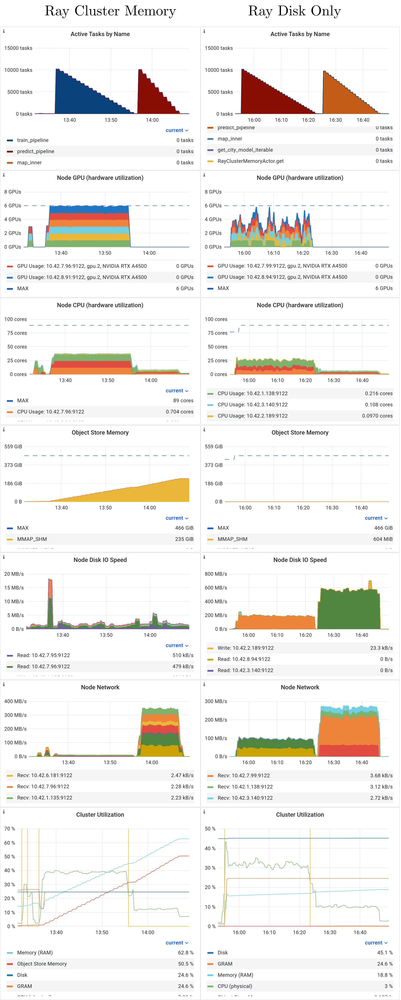
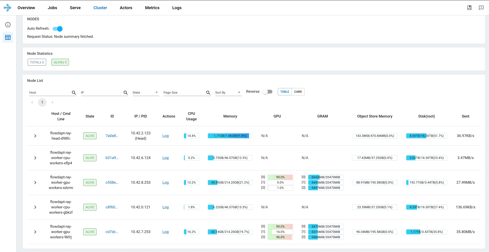
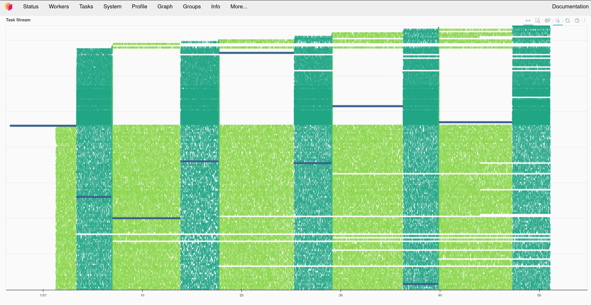

# Ray vs Dask: Lessons learned serving 240k models per day in real-time


## Introduction

Real-time, large-scale model serving is becoming the standard approach for key business operations. Some of these applications include LLMs, product/user demand forecasting, cybersecurity threat detection, cloud service monitoring and forecasting. Other businesses use real-time, large-scale model serving for their specific applications such as per-city weather nowcasting, per-asset financial forecasting, or even electrical grid load balancing. All these applications have one common constraint - consistent large-scale cluster compute demands resulting in high costs. 

The software running these clusters and serving these models is therefore a key component to reducing these costs and optimizing model performance. In addition to modern engineering architectures, the software requires sound applied machine learning methodologies. Luckily, large companies like Uber and Netflix have already tested a variety of methodologies for these types of large-scale dynamic systems. After multiple iterations through various architectures and software since 2016, Uber has recently settled on using Ray to orchestrate their model deployment (Ray Summit 2022). On top of Ray, they are using additional proprietary machine learning methodologies to optimize performance.  
  
Cluster orchestration libraries are key components to large-scale model serving. These are the foundational softwares responsible for inter-node communications, resource management, task scheduling, fault tolerance, and monitoring. Two of the open-source front runners in this domain are [Ray](https://docs.ray.io/en/latest/) and [Dask](https://docs.dask.org/en/stable/). These two libraries are similar in many ways, but different in others. For example, Ray and Dask both help users build and execute computational graphs for interacting, yet isolated, Python processes. The general agreement as of 2023 is that Ray can scale far beyond Dask due to its decentralized scheduling scheme, but Dask is more user-friendly and more performant for out-of-memory data manipulations. These points can be debated, but undoubtedly, both of these libraries are mature and production ready, which means they have strengths and weaknesses depending on their application.

Some important considerations of using Ray or Dask is that they both have their own unique syntax and methodologies for defining and executing computational graphs. Dask even has its own `DaskDataframe` and `DaskArray` that behave similarly to their pandas/numpy counterparts, but require special handling by the user. We at [Emergent Methods](https://emergentmethods.ai/) have developed an abstraction layer that frees the user from worrying about these syntaxes: [Flowdapt](https://docs.flowdapt.ai/). In fact, Flowdapt offers zero-code switching between Ray and Dask back-ends, allowing users to quickly test which back-end architecture optimizes their large-scale application best and saves them the most cloud compute costs. Beyond back-end agnosticism, Flowdapt is primarily designed to automate and optimize real-time MLOps in a production environment. This means that Flowdapt provides efficient model/data handling/versioning/storage. It also means that the adaptive machine learning algorithms are geared toward reducing electrical/cloud costs while maximizing performance. Additionally, Flowdapt adds easy cluster software installation, a REST API, cluster monitoring, and a user friendly dashboard.
### Objective

The objective of the following experiment is two fold. First, we aim to demonstrate the large-scale deployment of a real-time adaptive application managing the training and inferencing of 10k unique models per hour (240k per day). Second, we show how the simple [Flowdapt configuration](#train-and-inference-functions) can be run using Ray or Dask as the back-end executor with zero-code changes. This allows us to make key production-level [performance comparisons](#results) for these two executors such as GPU utilization, RAM usage, train duration, inference duration, and data collection duration. Given our experience building on and running these executors, we take this as an opportunity to provide [anecdotal comparisons](#anecdotal-comparisons-ray-vs-dask) of the Ray and Dask projects. For example, we make comparisons of the documentations, dashboards, source codes, debugging features, and more. 

## Test setup

Our large-scale, real-time model serving application example is a weather nowcasting plug-in that collects data, trains models, and runs inference on 10k unique models per hour in real-time and at different frequencies (Fig. 1). The cluster is comprised of 4 servers:  

- 2 GPU servers, each containing 2 x 16 core AMD EPYC Milan CPU 3.6 GHz, 3 A4500 GPUs, 256 GB RAM DDR4, 4TB NVMe
    
- 2 CPU servers, each containing 2 x 6 core Intel Xeon CPU X5660 2.80GHz, 64 GB RAM DDR3, 16 TB HDD
    

The 2 GPU servers are primarily used for training and inference, while the 2 CPU-only servers are primarily used for data collection, preprocessing, and inferencing. However, the back-end schedulers optimize these resources to best complete the complex computational graphs that are submitted with Flowdapt. 
### Data
Data for 1200 coordinates is streamed into Flowdapt using the [Openmeteo API](https://open-meteo.com/en/docs). Flowdapt then trains a set of models for each city including an XGboostRegressor, a PyTorch Transformer, a PyTorch LSTM, and a PyTorch MLP. For each of these architectures, we train for nine separate targets including variables such as temperature, wind speed, precipitation, radiation, and more. In total, 10,300 unique models are trained and inferenced every hour. This heterogeneity and volume of the model types/libraries and task frequencies means that Ray/Dask needs to accommodate extreme levels of context switching, data caching, serialization, resource handling, and task placement optimization across nodes. Additionally, we have heterogeneous nodes, which presents another layer of resource optimization for Ray/Dask/Flowdapt. The workflow orchestration is shown in Figure 1.


Figure 1: Example Flowdapt workflows for large-scale real-time machine learning deployment.

Each XGBoost model file is 100 kb and each PyTorch model file is 20 mb in size. In Dask, these files are all serialized to disk, but in Ray these files can be held in cluster memory for faster access. Historic weather data is collected and stored to disk as parquet and typically consists of 4 mb of data for each city. The most recent data needed for training/inference is held in cluster memory for both Ray and Dask, with Ray holding the Pandas dataframe object directly and Dask holding a DaskDataframe which is converted to a Pandas dataframe as soon as it is needed in the training stage.
### Software stack:
- All disk saved files are saved using distributed storage with [Minio](https://min.io/)
- Timing and health metrics collection with [Opentelemetry](https://opentelemetry.io/)
- Cluster deployment and monitoring with [Kubernetes](https://kubernetes.io/)
- Machine learning library [FlowML](https://docs.flowdapt.ai/flowml/), based on [XGBoost](https://xgboost.readthedocs.io/en/stable/) and [PyTorch](https://pytorch.org/)
- Data processing based on [SKLearn](https://scikit-learn.org/stable/index.html), [DataSieve](https://github.com/emergentmethods/datasieve), [Pandas](https://pandas.pydata.org/)
- Back-end executors [Ray](https://docs.ray.io/en/latest/) or [Dask](https://docs.dask.org/en/stable/)
### Experimental Configurations
1. Dask backend, datasets streamed to cluster memory and models in distributed storage
2. Ray (Disk Only) back-end , datasets streamed to cluster memory and models in distributed storage
3. Ray (Cluster Memory) back-end, datasets and models streamed to/from cluster memory

### Models
With a goal of demonstrating a highly heterogeneous cluster workload, all cities are trained with the following models

- PyTorchTransformer
- PyTorchLSTM
- PyTorchMLP
- XGBoostRegressor

Which are all optimized for serialization to disk and cluster memory using FlowML.
### Metrics 
- System CPU utilization
- System GPU utilization
- Data collection time
- Model training time
- Model inference time

## Results

As shown in Table 1, the time spent training one set of 10,300 models is fastest for Ray Cluster Memory, registering a duration of 16.4 minutes. This presents a 60% decrease in training time compared to Dask, and a 44% decrease in training time compared to Ray with Disk Only. This performance is reflected in the GPU utilization, which is maxed out at 97% for the entire training workflow in Ray Cluster Memory. Meanwhile, the disk constrained configurations spend time saving/loading the models through slower disk I/O which results in their struggle to keep the GPU's loaded (they sit around 40% GPU utilization). 

The largest gain in performance is observed in the inference time for 10,300 models, with Ray Cluster Memory outperforming Dask by 64%. Again, the disk I/O constrained back-end configurations are spending more than twice the amount of time waiting to retrieve the models from the distributed storage.

The comparison between the two disk constrained configurations, Ray Disk Only and Dask Disk Only, shows a fair comparison of the resource management on the two executors. Despite the same I/O constraints, Ray still outperforms Dask by 27% on the training workflow and 20% on the inference workflow. This indicates that Ray is handling the context switching, task scheduling, and task execution better than Dask.


Table 1: Average timings and resource usage for various workflows and backend configurations, each averaged across 10 realizations.

### Resource comparison Cluster Memory vs Disk Only

The following time-series metrics are displayed for a single realization of the Ray Cluster Memory and Ray Disk Only workflows. The first clear observation is that the GPU utilization is pinned at full use for almost the entire realization in Cluster Memory, but it is less than half for the Disk Only. This discrepancy is caused by the difference shown in the Node I/O plots, where Cluster Memory does not use any Node Network, and is therefore much faster to save the models for training.



## Anecdotal comparisons Ray vs Dask

In this section, we provide our subjective opinions on some of the key comparisons between Ray and Dask. Please keep in mind that these comparisons are primarily between Ray Core API and Dask Distributed. These libraries also have a wide range of other features which we do not cover here.

### Documentation
Ray’s documentation tackles a challenging problem - it supports a massive ecosystem while keeping the documentation readable and helpful. In comparison to most open-source software, Ray’s documentation is a cut above (except that they do not define default values for any parameters!). They even introduced a new Ray AI helper, which is interfacing to an LLM and is surprisingly useful. Dask’s documentation is also of high quality, with maybe a couple small complaints to be made about organization. 

**Verdict: tie**

### Source code
Ray’s open-source code base is all encompassing for their entire ecosystem. This makes it difficult to navigate for anyone new to the project. We suspect this is the result of years of multi-language, research-driven, high-collaboration development. Developer installation for core Ray development can be a tedious process depending on how much you need to modify. Meanwhile, Dask’s source code is neat and easy to navigate. But that is indeed a much easier feat for a monolingual smaller project. Debugging is reviewed in more depth below, but debugging the multi-lingual Ray project is far more difficult than debugging the Python-only Dask project.

**Dask wins**

### Community
Ray’s community appears quite a bit more active and helpful than Dask's. Ray has a dedicated active forum, an active Slack channel, and an active issue management system on Github. We have seen the developers interact with the general community in all three domains. Dask has a Discourse community that appears neglected by developers. Similarly, the Dask Github issues seem less attended to. Ray’s community is growing quickly now that most large tech companies are onboard with the library. Dask is more niche and reserved for data scientists, so the community remains small. 

**Ray wins** 

### Dashboard
Both Ray and Dask dashboards are indispensable for cluster debugging, log monitoring, and resource optimization. In general, the Dask dashboard is easier to use, more reliable, and more reactive. Although both dashboards show some level of system resource utilization, Dask enables much better visuals for task status/history/progress. The Dask dashboard lets users easily investigate individual tasks and all their dependencies/logs. These features can be useful for optimizing cluster resources, identifying bugs, and monitoring the system. Ray’s dashboard, on the other hand, is less responsive, provides coarser metrics, and is less intuitively organized. Furthermore, Ray’s dashboard is difficult to set up; users need to deploy/configure grafana and prometheus services in addition to their own cluster. Ray has a beta feature called the "Task Timeline" which would be useful, but it does not organize the rows by physical workers/resources. Instead it organizes by unique workers created for each task. This leads to thousands of rows for large submissions - rendering this Task Timeline useless. Dask, on the other hand, organizes its Tasks chart by physical workers.

**Dask wins**



Figure 3: Ray resource dashboard overview


Figure 4: Dask "Task Stream"


### Logging and error tracing
Logging and error tracing in Dask is generally superior to that of Ray. It makes sense, Dask is pure Python and so log handling is much more straightforward. Ray finds itself in a more difficult position - it is harder to collect/report errors that occurred in the middle of a large graph at remote parts of the cluster. With this said, Ray's dashboard lets you sift through and search failed tasks as well as all associated stdout/stderr. This is a powerful feature.

**Dask wins**

### Graph building (interface)
Computational graph building is common between the two libraries. Ray prides itself on simplicity, but its large ecosystem has resulted in alternative solutions that may be experimental or deprecated. For example, Ray has three ways of building and launching graphs - a new “Workflows” API, a developer level “DAG API” and a more user friendly approach of chaining object refs and calling `ray.get()`. Which one the user should use can become confusing quickly in such a large documentation (hint: stay away from the Workflows API if you need production level performance, we found that the Workflows API comes with an extraordinary amount of overhead). Dask, on the other hand, is clean and concise. There is one way to build a graph, it is well documented, and it is intuitive to use.

**Dask wins**

### GPU resource handling
The present study focused on training and inferencing on 10k small models. The model population was heterogeneous as well, ¼ XGBoost, ¼ PyTorch Transformer, ¼ PyTorch LSTM, ¼ PyTorch MLP. Further, each train involved saving the file to disk (or cluster memory) and each inference required loading it from disk (or cluster memory). This means there was a tremendous amount of context switching going on in this study. Ray seemed to handle this much more efficiently than Dask. Due to the size of these models, we were able to set each GPU to train four models at a time. In Ray, this was handled incredibly well in the disk I/O environment, and even more so in the cluster memory environment; we observed GPU utilization averaging around 75% throughout the duration of the experiment. While Dask does allow us to set up four worker processes per GPU, in practice, the context switching is slower and the GPU utilization hovered between 0 and 40%, averaging around 15%. We tried quite a few configurations to improve this for Dask, but in the end, we concluded that Dask cannot switch contexts as quickly as Ray when it comes to multiple GPU processes on a single GPU. 

**Ray wins**


### CPU resource handling
Dask’s resource management is trickier than Ray’s. Instead of Ray’s task = process approach, Dask has fewer workers handling more threads. Each thread can handle a task. This can be beneficial for I/O choked tasks, but in general it can yield problems if each process also spawns its own threads underneath. One approach would be to configure Dask to one core = one worker, similar to Ray. But in this configuration the context switching seems slow (which is confirmed by observations with the GPU resource handling, where the only way to have four separate processes running on a single GPU is to use four separate Dask workers). Overall, Dask is trickier, but when tuned for certain types of tasks, it can improve performance. 

**Ray wins**

### Debugging 
Debugging in Dask is simpler and more efficient than debugging in Ray. Dask runs pure Python, which means that the interactive debugger of VSCode works in the same fashion as it would with any other Python script. On the other hand, Ray is built on C++, which means that the debugging is clunkier and less interactive. In fact, Ray has a `ray debug` command which is designed to help users stop at `breakpoints()` set throughout their code. It works - but it is bare bones (even the arrow keys are ineffective inside this environment). Luckily, Flowdapt has multiple solutions to this debugging problem - first, users can simply swap to a Dask backend to debug their application interactively. Second, Flowdapt has its own local backend which runs code eagerly and in pure Python - so that Ray can also be run with an interactive modern debugger. 

**Dask wins**

### Cluster memory
Cluster memory handling in Ray is more feature rich than Dask. But as the results indicate - it is not a silver bullet. Dask only allows users to store `DaskDataframes` and `DaskArrays` in cluster memory, while Ray allows users to store any serializable object. Flowdapt abstracts both layers so that users do not need to worry about any of these Ray/Dask specific peculiarities, instead they simply call `object_store.put(“my_model”, MyModel)`. If the user is using Dask and the object they are trying to `put` can be converted to a Dask equivalent, then Flowdapt does this automatically for them. Otherwise, Flowdapt reverts back to placing the object in the distributed storage as an artifact. If the user is using Ray, most objects can go automatically to cluster RAM. In case the user wishes to save to distributed storage, they can simply pass the flag `artifact_only=True` and Flowdapt will place the object in distributed storage.

**Ray wins**

### Verdict
These subjective comparisons demonstrate the strengths and weaknesses of the two libraries. It is clear that Dask is more user-friendly, but Ray is more performant in this type of workload (heterogeneous, large-scale, fast context switching, lots of data movement).

We should note that our experiment did not demonstrate one of the key strengths of Dask, out of memory data handling. Although Ray also has this ability (in fact, you can use [Dask on Ray](https://docs.ray.io/en/latest/ray-more-libs/dask-on-ray.html) ), Dask was originally designed for out of memory data manipulations/trainings. Dask finds most of its users in the manipulation of these large-scale data sets, such as Geosciences or massive customer datasets. Meanwhile, Ray is generally suited for scalability and ease of data movement throughout the cluster. 

## Reproducing the experiment

*Here we present the configuration and the definition of the train/inference functions. However, details for installing and running Flowdapt and the presented Openmeteo weather forecasting plugin can be found at [https://docs.flowdapt.ai/](https://docs.flowdapt.ai/install/). *

#### Configuration
The configuration file used for this particular experiment is:

```yaml
config:  
study_identifier: "tds_article" 
executor: "RayExecutor"  # "DaskExecutor"
model_train_parameters:  
  # xgboost parameters  
  n_jobs: 4  
  n_estimators: 10  
  tree_method: "gpu_hist"  
  alpha: 0.5  
  min_child_weight: 5  
  learning_rate: 0.1  
  eval_metric: "rmse"  
  max_depth: 6  
  verbosity: 1  
  # PyTorch model parameters  
  epochs: 10  
  num_layers: 2  
  batch_size: 64  
  lookback: 6  
  hidden_dim: 1024  
  shuffle: True  
  num_threads: 4  
extras:
  num_points: 600  
  artifact_only: true  # set to false for cluster memory only
data_split_parameters:  
  test_size: 256  
  shuffle: false  
data_config:  
  origins: "openmeteo"  
  n_days: 25  # historical days of data to fetch
  neighbors: 2  # this is a grid of 4 coordinates around each target
  radius: 150  # radius of the neighbor coordinates
  target_horizon: 6  # hours  
  city_data_path: "user_data/plugins/openmeteo/uscities.csv"  
  models: ["XGBoostRegressor", "PyTorchTransformer", "PyTorchLSTMDirect", "PyTorchMLPRegressor"]  
  cities: 300  # number of target cities to build models for 
  targets: ["temperature_2m", "windspeed_10m", "cloudcover", "relativehumidity_2m", "apparent_temperature", "precipitation", "surface_pressure", "visibility", "uv_index"]
```

#### Defining the workflows
Workflows are sets of stages that have unique characteristics. Some stages may be parameterized across all 10,300 unique models, some may be parameterized across data sources. Workflows also define periodic scheduling to define how often the workflow should trigger.

```yaml
name: "openmeteo_train"
description: "Train/retrain 10,300 models using the latest data available in the cluster."

# cron definition for workflow scheduling
# This will execute this workflow once every 30 minutes
schedule: 
  - "30 * * * *"

# Define the stages for the workflow
stages:
 # build the iterable for the subsequent train_pipeline stage to expand upon
  - name: get_city_model_iterable
    target: flowdapt_openmeteo_plugin.stages.get_city_model_iterable
    resources:
      cpus: 0.5

  # This step is `type: parameterized`, which indicates that it will be parameterized across the output from the previous stage (10,300 model types)
  - name: train_pipeline
    target: flowdapt_openmeteo_plugin.stages.train_pipeline
    type: parameterized
    depends_on:
      - get_city_model_iterable
    resources:
      gpus: 0.25  # model sizes permit loading 4 per GPU

# attach the main parameter config by reference (this can be included directly if preferred, but sometimes it is useful to share a single main.yaml across a variety of workflows)
config: $ref{main.yaml|config}

```

#### Train and inference functions
Meanwhile, the training pipeline which is executed for each model at different Frequencies than the inference  stage (see Figure 1):
```python
from flowdapt.compute import object_store
from flowml.pipefill import PipeFill
from datasieve.pipeline import Pipeline
import datasieve.transforms as ds

def train_pipeline(row: dict):
    """
	Training stage, run for each model. This stage is part of a large parameter sweep on the model types.
	:param row: dictionary containing the metadata for the current
	model
    """
    # obtain the current context
    config = get_run_context().config
    data_config = config.data_config
    city, model, target = row["city"], row["model"], row["target"]

	# create a pipefill object for rapid serialization, and easy organization
    pipefill_name = f"{city}_{model}_target-{target}"
	pf = PipeFill(
		name_str=pipefill_name,
		study_identifier=config["study_identifier"],
		model_str=f"flowml.{model}",
		model_train_params=config.model_train_parameters,
		data_split_params=config.data_split_parameters,
		extras=config.extras
	)

	# pull the prepped df from cluster memory or disk
    raw_df = object_store.get(f"{city}_prepped_df")

	# clean the data. Remove any columns with too many Nans, remove any row with a nan
    raw_df = utils.remove_none_columns(raw_df, threshold=40)
    raw_df = utils.remove_rows_with_nans(raw_df)

    features, labels = utils.extract_features_and_labels(raw_df)
    labels = labels.filter(regex=target)
    pf.feature_list = features.columns
    pf.label_list = labels.columns

    # split the data and add data weights
    data_params = config.data_split_parameters
    w_factor = config.extra["weight_factor"]
    X, X_test, y, y_test, w, w_test = mlutils.make_train_test_datasets(features,
                                                                       labels,
                                                                       w_factor,
                                                                    data_params)

    # make the data preprocessing pipeline
    pf.feature_pipeline = Pipeline([
        ("raw_scaler", ds.SKLearnWrapper(MinMaxScaler(feature_range=(-1, 1)))),
        ("detect_constants", ds.VarianceThreshold(threshold=0)),
    ])

    # fit the feature pipeline to the features and transform them in one call
    X, y, w = pf.feature_pipeline.fit_transform(X, y, w)
    # transform the test set using the fitted pipeline
    X_test, y_test, w_test = pf.feature_pipeline.transform(X_test, y_test, w_test)

    # the labels require a separate pipeline (the objects are fit in the label parameter space.)
    pf.target_pipeline = Pipeline([
        ("scaler", ds.SKLearnWrapper(MinMaxScaler(feature_range=(-1, 1)))),
    ])

    y, _, _ = pf.target_pipeline.fit_transform(y)
    y_test, _, _ = pf.target_pipeline.transform(y_test)
    eval_set = [(X_test, y_test)]

	# fit the model
    pf.model.fit(X, y, eval_set=eval_set)

    # store the pipefill object in the object_store to be accessed in other disparate tasks of the cluster (e.g. predict_pipeline())
    object_store.put(
        pipefill_name,
        pf,
        artifact_only=config.extras["artifact_only"],
        save_artifact_hook=pf.to_artifact()
    )

    return
```

And the inference stage, executed for each model at different frequencies than the train stage (see Figure 1):
```python
def predict_pipeline(row: dict):
    """
	Inference stage, run for each model
	:param row: dictionary containing the metadata for the current
	model
    """
    config = get_run_context().config
    data_config = config.data_config

    city, model, target = row["city"], row["model"], row["target"]
    pipefill_name = f"{city}_{model}_target-{target}"

    num_points = config.model_train_params["lookback"]

    # Load the pipefill from the object store. This pipefill object was saved by train_pipeline() task in a different part of the cluster.
	pf = object_store.get(
		pipefill_name,
		artifact_only=config.extras["artifact_only"]
	)

	# pull the latest prepped df from cluster memory or disk
	raw_df = object_store.get(f"{object_name}_prepped_df")

	# tail the data so that we only inference on the 
    raw_df = raw_df.tail(num_points)
    features, _ = utils.extract_features_and_labels(raw_df)
    features = features.filter(items=pf.feature_list, axis=1)
    features = utils.remove_rows_with_nans(features)

    target = f"%-{city}-{target}"
    ground_truth = features[target].iloc[-1:]

	# ensure the features are transformed in the same way as they where for the training
    features, _, _ = pf.feature_pipeline.transform(features)

	# inference the model
    preds = pf.model.predict(features)
    # ensure the predictions are inverse transformed from their scaled space
	preds, _, _ = pf.target_pipeline.inverse_transform(preds.reshape(1, -1))
    preds = preds.to_numpy().squeeze()

    dates = raw_df['date'].apply(lambda x: x.strftime('%Y-%m-%d %H:%M:%S'))
    date = list(dates)[-1]

	# return the predictions. This will end up being a list of 10k dictionaries, one for each model.
    return {"preds": (row, preds, date, pf.label_list,
                      ground_truth.values, target)}
```

As shown in the two functions, there are no special syntax requirements for `Ray` or `Dask`. This means that the code above is executed exactly the same whether the user has configured `executor: "RayExecutor"` or `executor: "DaskExecutor"`. The main concept that the user needs to understand is the use of the `object_store.put()` and `object_store.get()` which is automatically handling all the `Ray` or `Dask` requirements underneath. The user simply adds any object they wish to the `object_store` using:
```python
city = "Miami"
df = pd.DataFrame()
object_store.put("Miami_df", df)
xgb_model = xgb.XGBRegressor()
object_store.put("Miami_regressor", xgb_model)
```

Then in any other stage, anywhere else in the cluster, the user can `get` that dataframe back with:
```python
df = object_store.get("Miami_df")
xgb_model = object_store.get("Miami_regressor")
```

*Notice how this was all performed without the user needing to handle any `Dask` `futures` or `Ray` `ObjectRefs`. Flowdapt is optimizing these objects in the backend, but the user still has full access to creating `Dask` `futures` and `Ray` `ObjectRefs` if they need/want to inside their stage*

If `Dask` is used for the executor, then the `"Miami_regressor"` will be automatically stored on disk, however if `Ray` is used for the executor, it will be automatically be stored in the more performant `cluster_memory`. This is a key point to the present experiment - as the Disk I/O is a bottleneck that is completely avoided when using `Ray` `cluster_memory`.

#### Installing the plugin and launching the workflows
After installing [Flowdapt](https://docs.flowdapt.ai), start the Flowdapt server:

```bash
flowdapt run
```

Then in a separate terminal, the Openmeteo plug-in can be installed with:

```bash
flowctl plugins install flowdapt-openmeteo-plugin --include-definitions
```

And then run the experiment with:
```bash
flowctl run create_features
```

Which will start streaming the data and training new models periodically.
